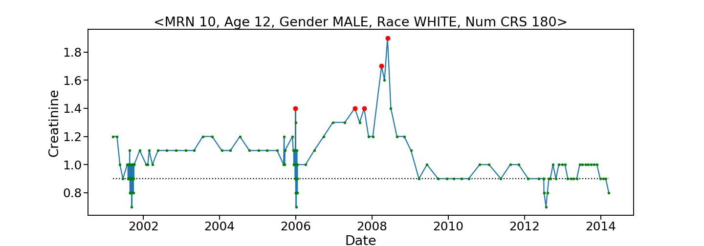

# Real time AKI risk Calculator using changes in serum creatinine
This program analyses a series of creatinine laboratory values and calculates the number of AKI, and their dates. It also has the ability to plot the results. 

## How to use the program
In order to use the program, you have to include patients creatinine values in the input folder as `Labsxx.csv` files. If you also want the estimated glomerular filtration rate, then a `Demographics.csv` file is needed with patients identifiers, age, gender, and race

## Input
Please see the current files in the `input` folder as an example of how the files are structured. 

```
Demographics.csv
MRN     Age     Gender     Race
1       50      MALE       WHITE
2       55      FEMALE     BLACK
3       44      FEMALE     ASIAN
4       58      MALE       BLACK
5       61      FEMALE     WHITE

Labs01.csv
MRN     Creatinine1     TestDate1
1       1               2001-09-12
1       1.2             2001-09-13
1       1.1             2001-09-14
1       1.2             2001-09-15
```

## Output
Upon running `AKIPredictor.py`, the information in the `Input` folder is proccessed, and the following files are written in the `Output` folder:
- `aki.csv`: This files contains a list of all patients, their estimated baseline creatinine, and baseline GFR, number of AKI episodes based on the AKIN criteria.
- `Dates` folder: This folder contains filed named by the patient's MRN, and lists the dates when AKI were detected for these patients listed.
- `Graphs` folder: This folder contains a list of `.png` names by patients MRNs, and illustrate the patients creatinine trend. The points identified as AKI episodes are highlighted in red.

Here is an example of the output:
```
MRN     baseCr     eGFR     numAKI     anyAKI     CKD
1       1.0        87.3     2          True       2.0
2       0.9        83.4     1          True       2.0
3       0.9        77.7     1          True       2.0
4       0.7        120.5    4          True          
5       0.8        79.5     0          False      2.0
```

 